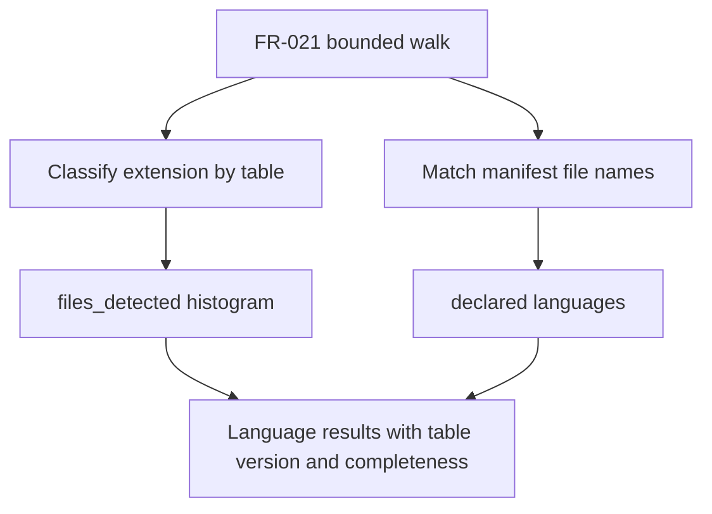

# Diagrams: Language Detection

The question here is how two kinds of evidence stay separate.

## How do extensions and manifests become language results? (flow)

```mermaid
flowchart TD
  A[FR-021 bounded walk] --> B[Classify extension by table]
  A --> C[Match manifest file names]
  B --> D[files_detected histogram]
  C --> E[declared languages]
  D --> F[Language results with table version and completeness]
  E --> F
```
