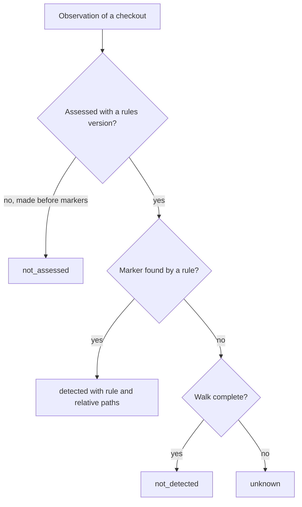

# Diagrams: Project Markers

The question here is when a marker may be called absent.

## How does a marker become detected, not detected, or unknown? (decision flow)

```mermaid
flowchart TD
  A[Observation of a checkout] --> B{Assessed with a rules version?}
  B -- no, made before markers --> C[not_assessed]
  B -- yes --> D{Marker found by a rule?}
  D -- yes --> E[detected with rule and relative paths]
  D -- no --> F{Walk complete?}
  F -- yes --> G[not_detected]
  F -- no --> H[unknown]
```
