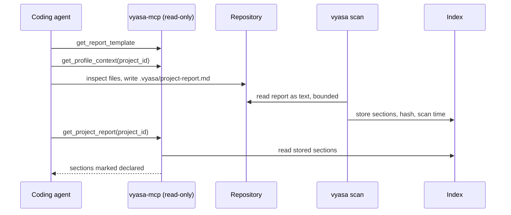

# Diagrams: Project Report

The question here is how a report moves from an agent's reading to a later query.

## How does a report get written, indexed, and served? (sequence)

```mermaid
sequenceDiagram
  participant A as Coding agent
  participant M as vyasa-mcp (read-only)
  participant R as Repository
  participant C as vyasa scan
  participant I as Index
  A->>M: get_report_template
  A->>M: get_profile_context(project_id)
  A->>R: inspect files, write .vyasa/project-report.md
  C->>R: read report as text, bounded
  C->>I: store sections, hash, scan time
  A->>M: get_project_report(project_id)
  M->>I: read stored sections
  M-->>A: sections marked declared
```
